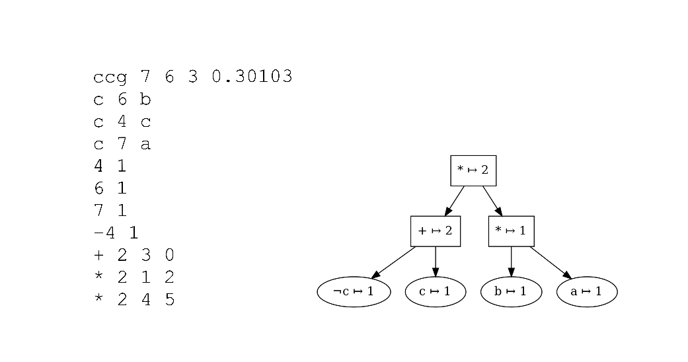

# ias :car: 
The **Incremental Answer Set Counter with Anytime Refinement**  and **Counting
Graph Compressor** as proposed in [[1]]().

**iascar** is a propositional model counter for formulae in so called _smooth deterministic decomposable negation normal form_ (sd-DNNF) [[2]](https://www.tandfonline.com/doi/pdf/10.3166/jancl.11.11-34?casa_token=vUB3KKgEZTEAAAAA:Y_6z-KXBR002dLW60_DjkqjZxo68XCTgLuuBmd3eBPlj98whbWj2pbVAHQTmPTnICCdkimC7gq9J).
In particular, iascar is tailored toward frequent answer set counting under
assumptions. However, it can also be used to count supported models (under
assumptions) of an answer set program. Even more so, iascar can also simply be
used to count the number of models of classic formula. 

iascar expects 
- either an
sd-DNNF in the format as defined in the archive of c2d available from
[http://reasoning.cs.ucla.edu/c2d/](); or 
- a counting graph in [CCG Format](#CCG-Format).

## Build 
```console
iascar$ cargo build --release
```
The resulting binary is `target/release/iascar`

## Usage
The following describes each use case of iascar demonstrated for answer set
program [`example_lp.lp`](examples/example_lp.lp) and a
[`cnf`](examples/p_xor_q.cnf) of the odd-2-parity function (XOR).

### Assumptions
To provide assumptions use the `-a` flag followed by whitespace seperated
integers, corresponding to literals. Omitting integers or the `-a` flag in
general evaluates to no assumptions. Invalid assumptions will be ignored.
In combination with the`-as` flag, always provide `-a` first.

Literal mappings of an answer set program can usually be found in the original
cnf instance of the program; at least when these
[tools](https://research.ics.aalto.fi/software/asp/download/) are used.
Compressing sd-DNNFs will preserve the original literal mappings and place them
on the beginning of the compressed counting graph (for more see [CCG 
Format](#CCG-Format)).
### Example 1 (**Incremental Answer Set Counting on Compressed Counting Graph with Bounded Alternation Depth**)
To count incrementally with bounded alternation depth use the `-as` flag and append the
alternation depth. Providing no alternation depth, or providing alternation
depth 0 results in the unbounded alternation depth. 

Note that it is **required** that you put the unsupported nogood constraints of
your instance `name.lp` in a file named `name.cycles` that satisfies the [UC
Format](#UC-Format) and lies on the same level as `name.ccg`. 
```console
iascar$ target/release/iascar examples/example_lp.ccg -a 7 -12 -as 1
```

### Example 2 (**Compressing Counting Graph: sd-DNNF to CCG**)
To obtain a compresssed counting graph from an sd-DNNF instance of an answer set
program provide the `-t` flag and the sd-DNNF.

Note that it is **required** that you put the cnf instance `name.cnf` of your
program `name.lp` and the program itself on the same level as `name.nnf`. 
```console
iascar$ target/release/iascar examples/example_lp.nnf -t 
```
### Example 3 (**Supported Model Counting on sd-DNNF**)
To count models on an sd-DNNF provide the `-cnnfasp` flag and the sd-DNNF.
```console
iascar$ target/release/iascar examples/example_lp.ccg -cnnfasp -a 7 -12
```
### Example 4 (**Model Counting on sd-DNNF**)
To count models on an sd-DNNF provide the `-cnnf` flag and the sd-DNNF.
```console
iascar$ target/release/iascar examples/p_xor_q.cnf.nnf -cnnf -a 1 -2
```

## CCG Format


A file in CCG format encodes a (compressed) counting graph such that 
- the first line $\text{ccg } v$ $e$ $n$ $c$ denotes
    - $v \dots$ number of nodes; 
    - $e \dots$ number of edges; 
    - $n \dots$ number of variables;
    - and $c \dots$ model count under no assumptions in log<sub>$10$</sub>;
- comments (e.g., literal mappings) start with character c;
- lines $i$ $b$ consisting of an integer $i$ and $b \in \{0,1\}$ correspond to a literal node labeled with literal $i$ and value $b$;
- lines $*$ $j$ $k$<sub>1</sub> $\dots k$<sub>$j$</sub> corresponding to a product (and-node) consisting of the number of children $j$ and the respective line indices of the children $k$<sub>$1$</sub> $\dots k$<sub>$j$</sub>;
- and lines $+$ $j$ $k$<sub>$1$</sub> $\dots k$<sub>$j$</sub> corresponding to a sum (or-node) consisting of the number of children $j$ and the respective line indices of the children $k$<sub>$1$</sub> $\dots k$<sub>$j$</sub>.

## UC Format


From the above positive dependency graph we can extract two unsupported constraints
```prolog 
:- a, b, not c, not g.
:- e, f, not g.
```
A file in UC Format contains combinations of unsupported constraints encoded by 
literal mappings and with leading characters `p` (add) and `m` (subtract). The first
line gives the number of cycles taken into consideration. Furthermore, again a line that starts with caracter c is a comment.
```
2
c a 1
c b 2
c c 3
c e 4
c f 5
c g 6
m -3 -6 1 2
m -6 4 5
p -3 -6 1 2 -6 4 5
```
**Note** that iascar expects literal mappings in .cycles files to be of this form `c variable integer`.
